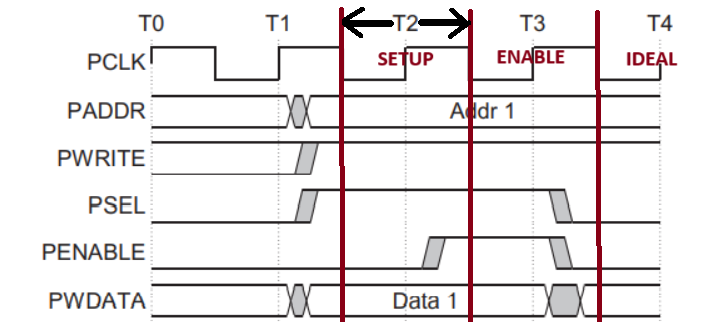
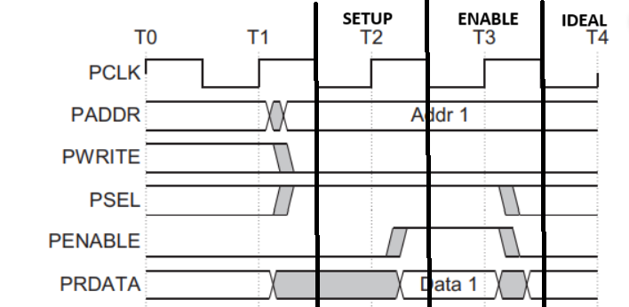

# Due to setup and hold violation, the inputs are driven at the ``negative edge`` of clock pulse.
## One clock cycle is considered from ``negedge`` of a clock pulse to ``negedge`` of the very next clock pulse.   

- Write operation

    

- Read operation

    

