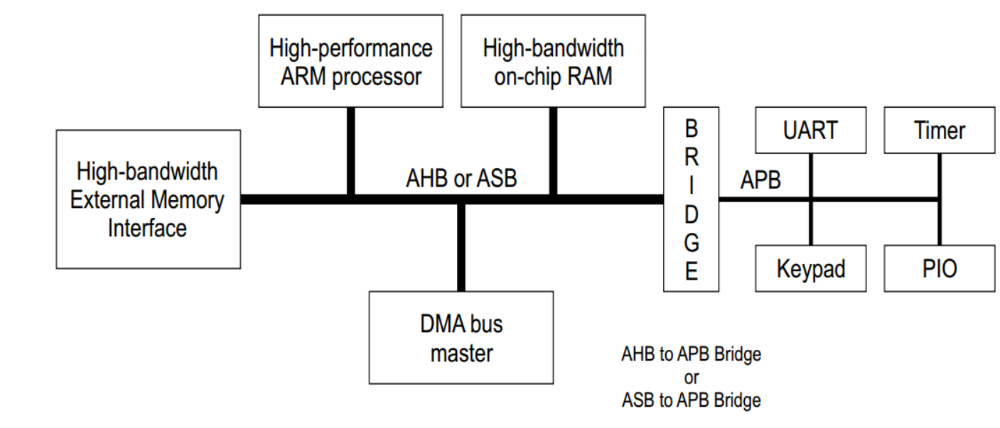
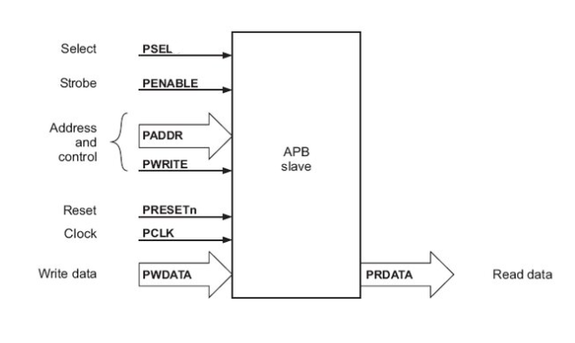
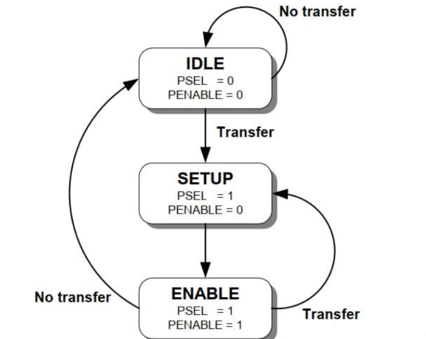
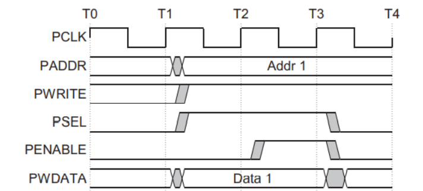

# Verification_AMBA-APB
## Design and Functional Verification of AMBA-APB protocol.
### Mritunjoy Kar Pial

 Dept. of Electrical and Electronic Engineering  
   Chittagong University of Engineering and Technology, Bangladesh

# Table of Contents 
- [Introduction of AMBA](#Introduction-of-AMBA)  
- [APB Specification](#APB-Specification)
  * [APB Interface Diagram](#APB-Interface-Diagram)
  * [APB Signal Description](#APB-Signal-Description)
  * [APB State Diagram](#APB-State-Diagram)
  * [APB Operating States](#APB-Operating-States)
    * [Write transfer](#Write-transfer)
    * [Read transfer](#Read-transfer)
-  [Testplan](#Testplan)
-  [Simulation results of APB design](#Simulation-results-of-APB-design)
-  [Conclusion](#Conclusion)
- [Acknowledgement](#Acknowledgement)
- [References](#References)

# Introduction of AMBA
- An AMBA-based microcontroller consists of high-performance system backbone bus, which is able to sustain the external memory bandwidth, on which the High-performance ARM processor and DMA devices reside, along with a bridge to narrower APB bus. The APB protocol is designed to connect low-bandwidth peripherals to the main system bus.

    

# APB Specification
- A low-cost interface, optimized for minimal power consumption and reduced interface complexity.
- The APB interface is not pipelined and is a simple, synchronous protocol. Every transfer takes at least two cycles to complete.
- APB peripherals are typically connected to the main memory system using an APB bridge.
## APB Interface Diagram
- Simple Interface diagram of APB Slave

  

## APB Signal Description

 **PCLK:** The rising edge of PCLK times all transfers on the APB.   
 **PRESETn:** Connected directly to System bus. The APB reset signal is active [LOW](#LOW).  
 **PADDR:** 32 bit address bus and is driven by thr peripheral bus bridge unit.   
 **PENABLE:** This signal indicates the second and subsequent cycles of an APB transfer.   
 **PSEL:** Select, the APB bridge unit generates this signal to each peripheral bus slave. Slave device is selected and transfer is required.   
 **PWRITE:**  APB write enables when [HIGH](#HIGH) and APB read enables when [LOW](#LOW).    
 **PWDATA:**  32 bits Write data, driven by peripheral bus bridge unit during write cycle when PWRITE is [HIGH](#HIGH).     
 **PREADY:**  Ready To extend an APB transfer.    
 **PRDATA:**  32 bits Read data during read cycle when PWRITE is [LOW](#LOW).   

## APB State Diagram
   
   

   
## APB Operating States

**IDLE :** This is the default state of the APB.                
**SETUP:**  When a transfer is required the bus moves into the SETUP state, where the appropriate select signal, **PSEL**, is asserted. The bus only remains in the SETUP state for one clock cycle and always moves to the ENABLE state on the next rising edge of the clock.                       
**ENABLE:** The enable signal, **PENABLE**, is asserted in the ENABLE state. The address, write, select, and write data signals must remain stable during the transition from the SETUP to ACCESS state.
The ENABLE state only lasts for a single clock cycle and after that, the bus will return to the IDLE state if no further trensfers are required. Alterntively, if another transfer is to followthen the bus will move directly to the SETUP state.

### Write Transfer

     

 [NOTE:: Click Here](NOTE.md)  
  **[Inside ``apb_driver`` , all inputs are driven at ``negative edge`` of clock pulse to overcome Setup and Hold time violation]**   

  
  **T2 Clock Cycle:** SETUP state, while PWRITE = HIGH, PSEL = HIGH, PENABLE = LOW.     
  **T3 Clock Cycle:** ENABLE state, while PWRITE = HIGH, PSEL = HIGH, PENABLE = HIGH. PADDR and PWDATA driven, PENABLE and PSEL will be deasserted at the end of the transfer, otherwise it will go to another transfer or ENABLE state.     
  **T4 Clock Cycle:** IDLE state, while PWRITE = HIGH, PSEL = LOW, PENABLE = LOW.    
  

### Read Transfer

       
 [NOTE:: Click Here](NOTE.md)  
  **[Inside ``apb_driver`` , all inputs are driven at ``negative edge`` of clock pulse to overcome Setup and Hold time violation]**     

  
  **T2 Clock Cycle:** SETUP state, while PWRITE = LOW, PSEL = HIGH, PENABLE = LOW.     
  **T3 Clock Cycle:** ENABLE state, while PWRITE = LOW, PSEL = HIGH, PENABLE = HIGH, the very same PADDR of Write transfer ENABLE state is driven.    
  **T4 Clock Cycle:** IDLE state, while PWRITE = LOW, PSEL = LOW, PENABLE = LOW.    
  * The output data ``PRDATA`` is sampled on the rising edge of clock at the end of the ``ENABLE`` cycle.
  
# Testplan    

